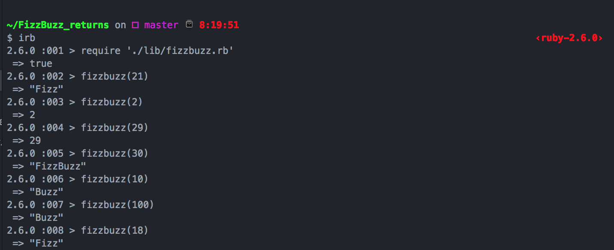

# Fizzbuzz_Returns
The return of Fizzbuzz!
Having worked on big projects for the past few weeks, I have decided to go back to something fun and always good to write.
A simple FizzBuzz program

The program prints:

* Multiples of 3 with 'Fizz'
* Multiples of 5 with 'Buzz'
* Multiples of both 3 and 5 with 'FizzBuzz'

### Setup

1. download/clone this repo
2. cd into project directory
3. run iRB on command line
4. require the file as so: require './lib/fizzbuzz.rb'

### Testing

run 'rspec' from the root

### Exemplar

